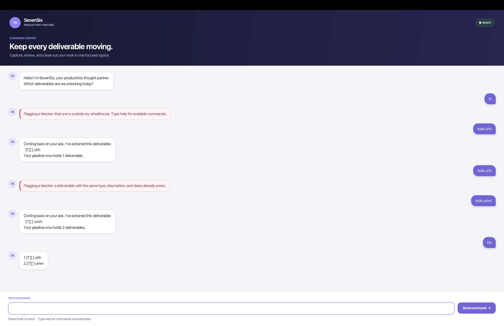

# SevenSix User Guide

**SevenSix** helps you track tasks, deadlines, and events by typing commands.
Its “deliverables” are your tasks; your “pipeline” is your task list.



[Quick start](#quick-start) · [Commands](#commands) · [Dates and times](#dates-and-times) ·
[Saving and backups](#saving-and-backups) · [Troubleshooting](#troubleshooting)

## Quick start

1. Install **JDK 25**. Run `java -version` in a terminal to check your version.
2. Once **v0.2** is published, get its `duke.jar` from
   [Releases](https://github.com/JonathanZheng/ip/releases). Until then, build the
   current version below. This is SevenSix despite its filename.
3. Place it in a writable folder. Open a terminal there and run `java -jar duke.jar`.
4. Type in the bottom box; press **Enter** or click **Send command**.
   Scroll to revisit replies. Red replies explain errors.

> **Version note:** This guide covers the upcoming **v0.2** release. The older
> `v0.1` JAR does not include all features described here.

To build: extract the [current source](https://github.com/JonathanZheng/ip/archive/refs/heads/master.zip).
In the folder containing `gradlew`, run `./gradlew shadowJar` (macOS/Linux) or
`gradlew.bat shadowJar` (Windows). Copy `build/libs/duke.jar` to your app folder.
The first build needs internet access.

Try these commands one at a time in a new task list:

```text
todo read book
deadline return book /by 2026-09-30 1800
event study group /from 2026-09-20 1400 /to 2026-09-20 1600
list
```

You should see:

```text
1.[T][ ] read book
2.[D][ ] return book (by: Sep 30 2026 6:00 PM)
3.[E][ ] study group (from: Sep 20 2026 2:00 PM to: Sep 20 2026 4:00 PM)
```

`[T]` means to-do, `[D]` deadline, and `[E]` event. `[ ]` means incomplete;
`[X]` means done. Try `mark 1`, then `undo` to restore its previous status.

## Before you type

- Use **lowercase commands** and flags, with a space before arguments: `mark 1`,
  not `mark1`. Descriptions may contain uppercase letters.
- Replace `DESCRIPTION`, `NUMBER`, and other placeholders with your values.
  Submit one command at a time.
- **Leading/trailing spaces and tabs are accepted.** Repeated spaces and tabs
  become single spaces, including inside descriptions and search phrases.
- Task descriptions cannot be empty. Unicode text, emoji, pipes (`|`), and
  backslashes are supported; embedded line breaks and control characters are not.
- `help`, `list`, `undo`, and `bye` take no arguments; `help todo` is rejected.

## Commands

### Getting help

**Format:** `help`

Shows command syntax and examples in the conversation, even when saving is
unavailable. Tasks and undo history stay unchanged.

### Adding tasks

New tasks start incomplete. Each addition shows the task and updated count.

#### To-do: a task without a date

**Format:** `todo DESCRIPTION`

```text
todo read book
```

#### Deadline: a task with a due date

**Format:** `deadline DESCRIPTION /by DATE`

```text
deadline return book /by 2026-09-30 1800
```

This adds a task due on 30 September 2026 at 6 PM.

#### Event: a task with a start and end

**Format:** `event DESCRIPTION /from START /to END`

```text
event study group /from 2026-09-20 1400 /to 2026-09-20 1600
```

This adds an event from 2 PM to 4 PM on 20 September 2026.
See [Dates and times](#dates-and-times) for other accepted formats.

#### Rules for adding tasks

Use `/by` once, or `/from` followed by `/to` once each. All values are required.
These standalone flags are reserved in dated commands; avoid them in descriptions.

Duplicates with the same type, case-sensitive description, and date/time values
are rejected, regardless of completion status.

### Viewing and finding tasks

**`list`** shows all tasks, including completed ones, in insertion order.

**Format:** `find KEYWORD` — for example, `find BOOK` finds both `read book`
and `return book`.

Search checks descriptions, ignores case, and matches parts of words. Multiple
words form one phrase: `find read book` requires that phrase. No matches produce
a message; tasks remain unchanged.

> **Use numbers from `list` when changing tasks.** Search results are numbered
> separately from 1. For example, if `find study` shows your third task as result 1,
> use `mark 3`, not `mark 1`, to complete it. Run `list` when unsure.

### Completing or reopening a task

| Action | Format | Example and result |
| --- | --- | --- |
| Complete | `mark NUMBER` | `mark 1` changes task 1 to `[X]`. |
| Reopen | `unmark NUMBER` | `unmark 1` changes task 1 to `[ ]`. |

Use an existing number from `list`, starting at **1**, with digits only.
Completed tasks stay in the list.

### Deleting a task

**Format:** `delete NUMBER` — for example, `delete 2` removes the second task
from the full list immediately, without confirmation.

Remaining tasks are renumbered. Run `list` before another change, or `undo` to
restore an accidental deletion.

### Changing a description or date

There is no direct editing command. To replace a task:

1. Add the corrected task using `todo`, `deadline`, or `event`.
2. Check that the addition succeeded, then run `list`.
3. Use `delete NUMBER` with the **original task's** number.

The replacement appears at the end of the list and starts incomplete. If needed,
run `list` again and `mark NUMBER` to complete it. Adding and deleting are separate
changes: `undo` after the deletion restores the original but keeps the replacement.

### Undoing your last change

**Format:** `undo`

Restores and saves the list from before the latest successful add, mark, unmark,
or delete command.

```text
delete 2
undo
```

This restores task 2 in its original position. There is **one undo step**:
another task-changing command replaces it; `undo` consumes it. Even marking an
already-completed task replaces that step. `list`, `find`, `help`, and failed
commands preserve it. Closing the app clears undo history. There is no redo.

### Exiting

**Format:** `bye`

Closes SevenSix. The window's close button also works. Successful changes are
already saved.

## Dates and times

Use real calendar dates with an optional **24-hour time**, precise to the minute.

| Input | Meaning |
| --- | --- |
| `2026-09-30` or `30/9/2026` | 30 September 2026, date only |
| `2026-09-30 1800` or `30/9/2026 1800` | 30 September 2026 at 6 PM |
| `2026-09-30 18:00` or `30/9/2026 18:00` | The same date and time, with a colon |
| `2026-09-30T18:00` | The same date and time in ISO format |

Dates display in English. Words such as `tomorrow`, impossible dates such as
`2026-02-30`, and times such as `2400` are rejected.

An event must end **strictly after** it starts. An omitted time counts as midnight
when comparing its endpoints, so a same-day event needs a later end time.
SevenSix records dates; it does not send reminder notifications.

## Saving and backups

Successful changes save automatically to `data/duke.txt` inside your launch folder.
**Launch from the same folder each time** to reload your tasks. A first run starts
empty; adding a task creates the file. Conversation and undo history are not saved.

To back up or transfer tasks, close SevenSix and copy `data/duke.txt`. On the new
computer, install Java 25 and place the copy in your app folder's `data` directory.
Back up any existing file before replacing it.

## Troubleshooting

| What happened? | What to do |
| --- | --- |
| Unknown command | Check spelling and lowercase keywords; enter `help` for syntax. |
| Invalid task number | Run `list` and use an existing number from that list, without a sign or decimal point. |
| Invalid date or parameters | Check the formats above and use each required flag once, in order. |
| Duplicate task | Use the existing task or change its description/schedule. Completion status does not make it distinct. |
| Nothing to undo | Make a successful task change first. Only the latest change in this session can be undone. |
| Empty list after moving the JAR | Check your launch folder and restore your saved `data/duke.txt` there. |
| Startup storage warning | Saving is disabled; valid loaded tasks remain viewable. Close the app, back up the file, fix its path/permissions or restore a valid backup, then restart. |
| A change could not be saved | Tasks and undo history were restored. Check file/folder permissions and free disk space, then retry. |
| Java version or launch error | Check `java -version` reports 25 and that the terminal is in the folder containing `duke.jar`. |

Correct rejected commands and submit them again. The GUI ignores blank input;
the console reports an error.
